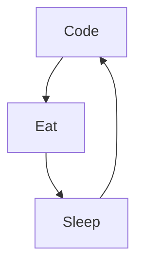

### Hi there 👋

### Connect with me:

&nbsp;&nbsp;

&nbsp;&nbsp;

&nbsp;&nbsp;

&nbsp;&nbsp;

### Languages and Tools:

 

### My daily routine 

```mermaid
  graph TD;
      Code-->Eat;
      Eat-->Sleep;
      Sleep-->Code;
```

### ⭐ GitHub Stats

